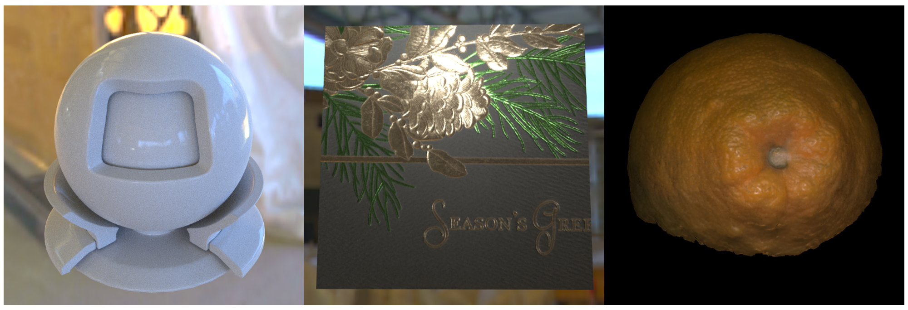

# Drawlab

Drawlab is a physically based path tracer that runs on a NVIDIA graphics card with OptiX 7.

## Features

- Unidirectional path tracer
    - Support two backends: CPU, OptiX
    - Two rendering modes: online GUI interaction, offline rendering
    - XML scene description file like mitsuba
    - Multi-importance sampling
- Material
    - Diffuse
    - Mirror
    - Dielectric
    - Microfacet
    - Anisotropic GGX
- Camera
    - Perspective camera
    - Pinhole camera(opencv camera)
- Light
    - Area light(bind to a triangle mesh)
    - Point light
    - Environment light(HDR/EXR image)
- Geometry
    - Mesh(.obj)
    - Rectangle

## Gallery

## Install

Please refer to the [INSTALL](docs/INSTALL.md) for the build instructions for Windows and Linux.

## Documentation

For documentation, please refer to [Documentation](docs/DOCUMENTATION.md)
  

